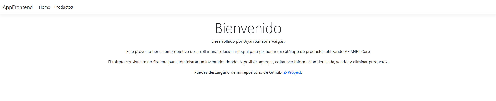
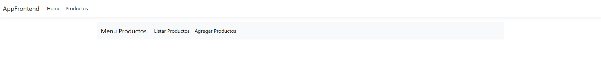
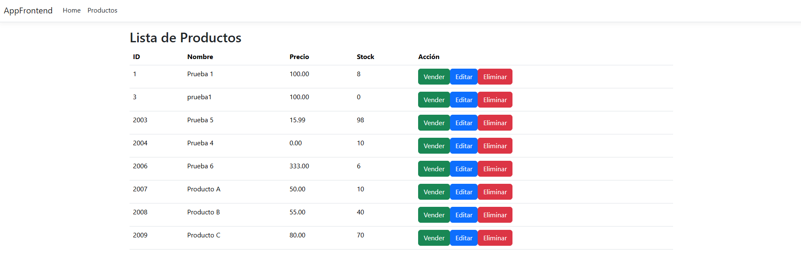
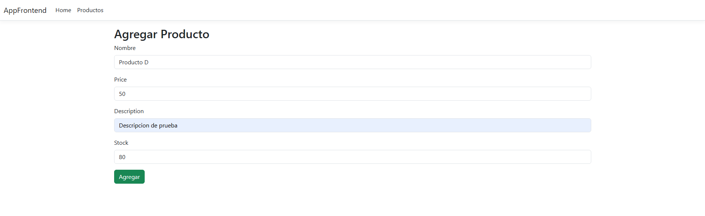

# Gestor de productos  

---

## 📋 Índice  
1. [Descripción del Proyecto](#-descripción-del-proyecto)
2. [Configuracion del Proyecto](#-configuracion-del-proyecto)  
3. [Demostración de Funciones](#-demostración-de-funciones-y-aplicaciones)  
4. [Acceso al Proyecto](#-acceso-al-proyecto)  
5. [Tecnologías Utilizadas](#-tecnologías-utilizadas)  
6. [Personas Desarrolladoras del Proyecto](#-personas-desarrolladoras-del-proyecto)  

---

## 📝 Descripción del Proyecto  
**[Gestor de productos]** es un proyecto Fullstack implementado a traves de ASP.NET Core, el cual consiste en un sistema administrador de inventario, que nos permite agregar, editar, ver informacion detallada, vender y eliminar productos.

---

## 📝 Configuración del Proyecto  
### Requisitos previos:
- **.NET Core 8.0**
- **SQL Server** 
- **Visual Studio**
- **Entity Framework**

### Pasos para ejecutar el proyecto:
1. **Clonar el repositorio**  
   Clona este repositorio en tu máquina local:  
   `git clone https://github.com/BryanSV93/Z-Proyecto`

2. **Instalar dependencias**  
   Ejecuta el siguiente comando en la terminal para restaurar las dependencias de NuGet:  
   `dotnet restore`

3. **Configuración de la base de datos**  
   Configura la cadena de conexión en el archivo `appsettings.json` para conectar la aplicación con tu base de datos SQL.

    "ConnectionStrings": {
   "DefaultConnection": "Server=.;Database=nombreBaseDatos;User Id=sa;Password=constraseñaBaseDatos;TrustServerCertificate=True;"
 }

4. **Ejecutar el proyecto**  
   Inicia la aplicación con:  
   `dotnet run`

---

## 🎥 Demostración de Funciones 
### Funciones Principales:  

- **Swagger del Backend **: [https://localhost:7206/swagger/index.html].  
 

- **Paso 1**: [Selecciono el botón Productos para ingresar al modulo Menu de Productos].  
 

---

- **Paso 2**: [Selecciono el botón Listar Productos para ingresar al modulo de lista de productos, el cual nos permite vender, editar o eliminar un producto deseado].  
 

---

- **Paso 3**: [Selecciono el botón Agregar Producto para ingresar al modulo de ingreso de productos].  
 

---

## 🚀 Acceso al Proyecto  
Puedes acceder al proyecto mediante:  
- **Repositorio en GitHub**: [Enlace al repositorio](https://github.com/BryanSV93/Z-Proyecto)  

---

## 🛠️ Tecnologías Utilizadas  
- **Backend**: ASP.NET Core 8.0
- **Frontend**: Razor Pages
- **Base de Datos**: SQL Server
- **API REST**: ASP.NET Core Web API  
- **Contenedores**: Docker

## 👨‍💻 Personas Desarrolladoras del Proyecto  
- **Bryan Miguel Sanabria Vargas**  
  - [LinkedIn](https://linkedin.com/in/bryansanabriavargas)  
  - [GitHub](https://github.com/BryanSV93)  

---